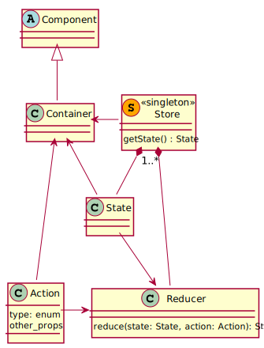

# 3. Architektura

## 3.1. Zastosowane technologie

### 3.1.1. [React](https://www.npmjs.com/package/react)

Do wytworzenia aplikacji wykorzystana została w warstwie prezentacji 
biblioteka JavaScriptowa React. Biblioteka ta umożliwia łatwe tworzenie 
interfejsów użytkownika aplikacji internetowych.

### 3.1.2. [Material-UI](https://www.npmjs.com/package/@material-ui/core)

Zestaw komponentów Reacta, których używanie znacząco ułatwia projektowanie
widoków poprzez możliwość używania 
- gotowych osylowanych komponentów
- komponentów zarządzających siatką komponentów na stronie

```html
<Typography align="center" variant="display1" onClick={()=>this.props.onClick()}>
    <MdAddCircleOutline />
</Typography>
```

### 3.1.3. [Redux](https://www.npmjs.com/package/react-redux)

Kontener stanu wymuszający stosowanie pewnej, określonej architektury, 
pozwalający na zarządzanie stanem aplikacji. Więcej na temat użycia Reduxa
w naszej aplikacji znajduje się poniżej.

### 3.1.4. [Redux Undo/Redo](https://www.npmjs.com/package/redux-undo)

Dodatkowa funkcjonalność do Reduxa pozwalazjąca na dostęp do stanu obecnego
aplikacji, ale też stanów poprzednich i dodająca metody cofania i przywracania
stanu.

```javascript 1.6
dispatch(ActionCreators.redo())
```

### 3.1.5. [Recharts](https://www.npmjs.com/package/recharts)

Biblioteka do Reacta umożliwiająca proste tworzenie wykresów _svg_ w 
aplikacji. Jej głóną zaletą jest zagnieżdżanie komponentów wykresu, jak 
np. legendy, co umożliwia prostą ich podmianę.  

```html
<ScatterChart width={100}>
    <YAxis dataKey="y" />
    <Scatter xAxidId="x" data={EXAMPLE_POINT_DATA} fill="black"/>
</ScatterChart>
```

### 3.1.6. [React-Datasheet](https://www.npmjs.com/package/react-datasheet)

Prosty komponent Reacta będący tabelką symulującą wygląd i zachowania
arkuszy kalkulatyjnych __Excel__. Jest to główna zaleta.

```html
<ReactDataSheet data={this.generateGrid()}
                valueRenderer={(cell) => cell.value}
                onCellsChanged={changes => this.onCellsChanged(changes)}
/>
```

## 3.2. Architektura zarządzania stanem

Do zarządzania stanem użyliśmy [__Reduxa__](https://redux.js.org/), czyli 
biblioteki javascriptowej przeznaczonej do właśnie takiego celu. Jest ona
inspirowana architekturą Flux, ale w przeciwieństwie do niej nie posiada
konceptu _dispatchera_. 

Całość opiera się o koncepcję __Store'a__, który przechowuje stan aplikacji
(a u nas też i poprzednie). Store jest dokładnie jeden na całą aplikację.

W aplikacji definiowane są też __Actions__, czyli obiekty zawierające typ
akcji(skrótowa nazwa definiująca, czego akcja dotyczy) oraz pozostałe 
parametry potrzebne do jej wykonania. Za faktyczne implementacje akcji
odpowiadają jednak reducery.

__Reducery__ zajmują się obsługą któregoś z podstawowych obiektów 
składających się na stan aplikacji. W zależności od wywołanej akcji 
interpretują stan obecny i tworzą nową instancję stanu następnego. 

Kontenery (__Containers__) są uzupełniają komponenty o obsługę stanu 
globalnego aplikacji. Mapują stan aplikacji na stan wewnętrzny komponentu
oraz dodają im możliwość wywoływania akcji.

Komponenty (__Components__) to zwykłe reaktowe komponenty. Bazują mają jednak
charakter abstrakcyjny, gdyż do ich działania często potrzebny jest stan
globalny dostarczany przez kontenery.

 

## 3.3. Zastosowane wzorce projektowe

### 3.3.1. Singleton 

Store ma charakter signetonu, gdyż przechowuje stan aplikacji, a odwołać się
do niego możemy z każdego miejsca. 

### 3.3.2. Obserwator

Komponenty (za pośrednictwem kontenerów) zmieniają swój stan za każdym razem,
gdy zmieni się stan globalny aplikacji przechowywany w Store.

### 3.3.2. Fabryka

W zależności od przechowywanym w stanie globalnym typie wykresu zwracany 
jest zupełnie inny komponent.
