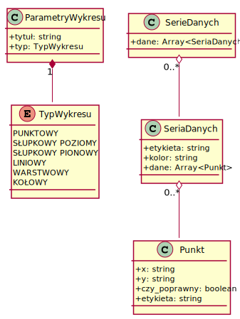
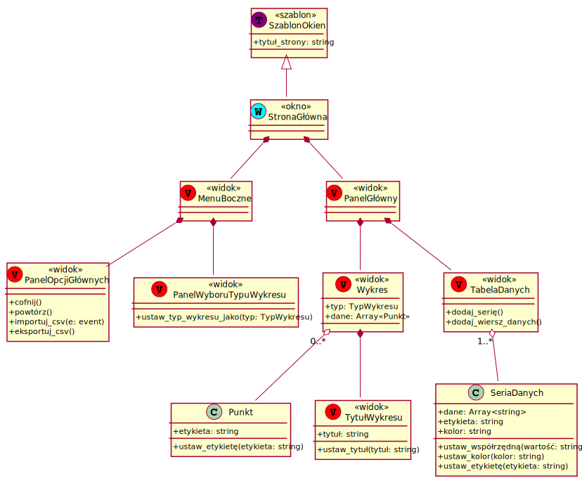
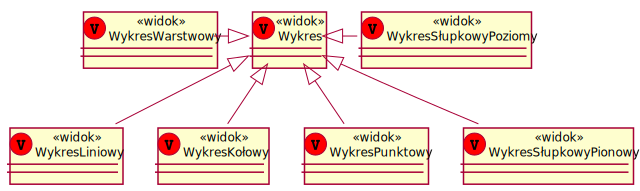

# 1. Model

## 1.1. Wymagania

Aplikacja ma wyświetlać wykres danych wprowadzanych za pomocą interaktywnej
tabelki lub poprzez wprowadzenie pliku. Jej głównymi funkcjonalnościami
mają być:

- Interaktywne definiowanie danych tabelarycznych
- Ustawianie typu wykresu
- Definiowanie kolorów serii danych
- Wyświetlanie legendy
- Wyświetlanie i zmiana tytułu
- Dodawanie etykiety do dowolnego punktu wykresu
- Cofanie i powtarzanie pewnej liczby operacji
- Importowanie i eksportowanie plików csv do i z tabelki danych

## 1.2. Dziedzina użytkownika

Nasza aplikacja posiada dwa drzewa danych, których instancje są potem 
używane w wielu miejscach w aplikacji. 

Pierwszym z nich są parametry wykresu, które przechowują
informacje i prezentacji danych na wykresie. U nas są to tytuł i typ.

Następnym z nich są serie danych. Zawierają informacje o danych wprowadzanych
przez użytkownika i parametrach do nich dowiązanych. Każda seria danych
ma przypisany kolor i etykietę oraz ma przypisane punkty danych.
Każdy punkt posiada obie współrzędne, informację, czy jest on poprawny
(jest wtedy wyświetlany w tabeli danych, ale na wykresie nie) oraz etykietę,
którą użytkownik może przypisać do punktu.

## 1.3. Dziedzina interfejsu

Nasza aplikacja posiada tylko jedną stronę główną. Składa się ona z menu
bocznego i panelu głównego. 

Panel główny to faktyczna przestrzeń robocza 
użytkownika. Interaktywne wykres i tabela pozwalają na prostą i szybką edycję
danych. Tabela danych pozwala na edycję serii danych, punktów do niej
przypisanych oraz parametrów jej prezentacji( nazwy i koloru ). Wykres zaś
ma odrębny, edytowalny tytuł oraz punkty danych, którym można przypisać 
etykietę.

Panel boczny zawiera wszyskie panele opcji, czyli panel cofania ruchów i 
importu danych oraz panel wyboru typu wykresu.

Sam wykres, ze względu na różną specyfikę wyświetlania dla różnych jego typów,
posiada odrębną implementację jego widoku. Wspierane są wykresy:

- słupkowe poziome
- słupkowe pionowe
- linowe
- kołowe
- punktowe
- warstwowe

