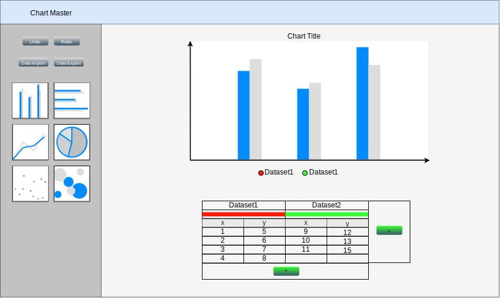

# Statyczny projekt interfejsu

## 1. Wstęp

### 1.1 Wykorzystane narzędzia - draw.io
Do stworzenia diagramu wykorzystano darmowy program draw.io. Posiada on wbudowane elementy przydatne przy prototypowaniu interfejsu użytkownika takie jak przyciski czy wykresy. 

### 1.2 Cele proptotypu
Głównym celem tworzenia prototypu funkcjonalnego była potrzeba zaplanowania rozłożenia elementów użytkownika w oknie aplikacji. Ostateczny interfejs nie powstał od razu, jego wytworzenie wiązało się w wieloma projektami "na brudno" i dyskusją nad rozłożeniem poszczegónych elementów. Był to proces iteracyjny.

### 1.3 Główne założenie stworzonego prototypu
Podczas tworzenia prototypu pomimo różnych wczesnych wersji zdecydowaliśmy, że spróbujemy stworzyć interfejs podobny do innych znanych już interfejsów, tak oby przyszły użytkownik mógł bez trudności odnaleźć się w naszej aplikacji. Ponadto chcieliśmy zrezygnować z jak największej ilości dodatkowych widoków. Dlatego też cała interfejs został zaprojektowany tak by minimalizować niepotrzebne dadatki. Tym sposobem ograniczyliśmy interfejs aplikacji tylko do __jednego__ widoku.

## 2. Opis interfejsu aplikacji

### 2.1 Wykres
Podstawowym elementem aplikacji do tworzenia wykresów został oczywiście wykres. Wykres zmienia swój tryb w zależności od tego jaki typ wykresu wybierze użytkownik.
* Bezpośrednio nad nim znajduje się tytuł wykresu. Można go edytować klikając na tytuł, wtedy otworzy się on w trybie edycji. 
* Klikając bezbośrednio w punkt zaprezentowany na wykresie oznaczamy go strzałką. Użytkownikowi pokaże się dialog w którym bedzie poproszony o podanie nazwy strzałki. 
* Pod wykresem znajduje się legenda informująca i identyfikująca zaprezentowane na wykresie zbiory danych.

### 2.2 Tabela 
Pod wykresem znajduje się tabela wykonana w stylu znajomego dla użytkownika arkusza kalkulacyjnego programu Excel. Tabela ta jest głównym punktem sterowania aplikacją.  Dokładna struktura tabeli została wcześniej zaprojektowana, by umożliwić użytkownikowi bezpośredni dostęp do wielu elementów charakteryzujących przedstawiane na wykresie dane. Wymagane było także podjęcie decyzji aby dane zawsze przedstawiać i przechowywać w formie punktów o współrzędnych x i y. Jest to domyślny tryb dla większości dostępnych w aplikacji wykresów: punktowego, liniowego, obszaru, słupkowego pionowego i poziomego. Wyjątkiem jest wykres kołowy w przypadku którego zdecydowaliśmy wykorzystywać tylko współrzędną x danego punktu, wspórzędna y zostaje pominięta. Jednak dla przejrzystości wyświetlania danych przechowywanych jako punkty dwóch wspórzędnych, nie zmienialiśmy sposobu wyświetlania tabeli. Dokładny opis struktury tabeli według wierszy:
* Nazwa zbioru danych - Pierwszy wiersz składa się ze scalonych po dwie kolumn prezentujących nazwy zbiorów danych. Edytując komórki użytkownik może zmienić nazwę zbioru danych.
* Wskaźnik koloru danego zbioru danych - Drugi wiersz to także scalone komórki identycznie jak w wierszu pierwszym. Zawierają one jednak prostokąty będące wskaźnikiem koloru danego zbioru danych. Klikając na dany wskaźnik użytkownikowi ukazuje się domyślna pleta wyboru koloru. Wbierając kolor z palety użytkownik zmienia kolor danego zbioru danych.
* Etykiety porządkujące - Wyłączone z edycji komórki zawierają kolejno wpisane etykiety "x" i "y" bedące punktem odniesienia dla użytkownika podczas edycji danych.
* Współrzędnie punktów - Niższe wiersze tabeli zawierają odpowiednio kolejne współrzędne punktów, umieszczene w poziomie pod nazwą danego zbioru danych. Użytkownik może bezpośrednio edytować komórki edytując wartości w zbiorze danych. 
* Pozostałymi równie ważnymi elementami tabeli są przycisk dodawania nowych zbiorów danych i przycisk dodania współrzędnych do istniejących już zbiorów danych. Są one umiezczone w sposób intuicyjny. Przycisk nowych zbiorów danych na śroku wysokości tabeli na prawo od niej, a przycisk przycisk dodania współrzędnych na środku szerokości tabeli pod jej spodem. Efektem działania tych przycisków są odpowiednio utworzenie całego nowego pustego zbióru danych który pojawia się na prawo od istniejących już zbiorów dla przycisku dodawania nowych zbiorów danych i dodanie do każdego zbioru pustych komórek będących współrzędnymi nowego punktu dla przycisku dodania współrzędnych.
  
### 2.3 Sidebar
Po lewej stronie interfejsu znajduje się pasek boczny, na którym znajdują się pozostałe elementy interfejsu. Zaczynając od góry na jednej wysokości umiezczone są przyciski Undo i Redo. Umożliwiają one cofanie i powtarzanie akcji aplikacji. Poniżej umieszczone są przyciski "Import Data" i "Export Data". Klikając "Import Data" użytkownikowi prezentuje się systemowo okno wyboru pliu. W ten sposób możliwe jest załadowanie do aplikacji danych z pliku CSV. Wybranie przycisku "Export Data" uruchamia natychmiastowe pobieranie danych z aplikacji w formacie pliku CSV. Poniżej znajduje się matryca sześciu dużych kwadratowych przycisków, pozwalających na wybranie typu wykresu.

### 2.4 Appbar
Interfejs wieńczy pasek umieszczony nad pozostałymi elementami. Przedstawia on po lewej jego stronie nazwę aplikacji.

