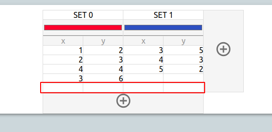

# 4. Zadaniowa instrukcja obsługi

## 1. Wygląd wykresu

### 1.1 Jak zmienić typ wykresu?

  

Aby zmienić typ wykresu należy z wybrać jeden z sześciu przycisków na pasku bocznym. Kliknięcie _LPM_ natychmiastowo zmieni tryb wykresu.
Dostępne do wyboru są kolejno:

* Wykres słupkowy pionowy
* Wykres słupkowy poziomy
* Wykres powierzchni
* Wykres kołowy
* Wykres liniowy
* Wykres punktowy

### 1.2 Jak zmienić tytuł wykresu?

  

Zmiany tytułu wykresu można dokonać klikając _LPM_ bezpośrednio na tytuł. Uruchomiony zostanie tryb edycji, który pozwala na zmianę tytułu. Zmianę zatwierdza się klikając _LPM_ poza polem tekstowym wprowadzania tytuły wykresu.

### 1.3 Jak dodać własną strzałkę na wykresie?

  

W celu dodania własnej strzałki należy kliknąć na dany punkt na wykresie. W dialogu należy podać opis własnej strzałki. Zatwierdzić edycję ponownym kliknięciem.  

  

## 2. Edycja danych

### 2.1 Jak zmienić współrzędną punktu?

  

Aby zmienić współrzędną punktu w tabeli przedstawiającej dane należy dwukrotnie kliknąć _LPM_ na wybraną komórkę z tabeli. Istnieje też możliwość użycia kombinacji _LPM + Enter_. Następnie należy wprowadzić własną wartość i potwierdzić zmianę za pomocą klawisza _Enter_ lub klikając _LPM_ poza komórką.

### 2.2 Jak zmienić nazwę zbioru danych?

  

Zmianę nazwy wybranego zbioru danych dokonać można poprzez dwukrotnie kliknięcie _LPM_ na wybranej nazwie zbioru lub używając kombinacji _LPM + Enter_. Następnie należy wprowadzić w komórce nową nazwę zbioru danych i potwierdzić zmianę za pomocą klawisza _Enter_ lub klikając _LPM_ poza komórką.

### 2.3 Jak zmienić kolor zbioru danych?

  

Zmianę koloru wybranego zbioru danych dokonać można poprzez dwukrotnie kliknięcie LPM lub użyciu kombinacji LPM + Enter na wskaźniku koloru danego zbioru danych znajdującego się w drugim wierszu, bezpośrednio pod nazwą zbioru danych.  

    

Na pierwszym planie pokaże się paleta wyboru koloru. Klikając na palecie _LPM_ wybieramy nowy kolor zbioru danych. Zmianę koloru można jeszcze anulować klikając "__X__" w prawym górnym rogu palety kolorów.

### 2.4 Jak dodać nowy zbiór danych?

  

Aby do wykresu dodać kolejny zbiór danych kliknąć _LPM_ na przycisk dodawania nowego zbioru danych, znajdującego się na prawo od tabeli. Wynikiem tej operacji jest nowy pusty zbiór danych, który można uzupełnić danymi, edytować jego nazwę oraz kolor.  

    

### 2.5 Jak dodać nowe punkty do istniejących już zbiorów?

  

Dodanie nowego punktu do zbioru danych jest możliwe poprzez kliknięcie _LPM_ przycisku dodawania nowych punktów, znajdującego się pośrodku tabeli, pod jej spodem.
Efektem tego działania jest dodanie nowych pustych komórek współrzędnych punktów do każdego z istniejących już zbiorów danych.  

  

### 2.6 Jak wyeksportować dane do pliku CSV?

Eksport wszystkich współrzędnych punktów wszystkich przedstawionych zbiorów danych jest możliwy poprzez kliknięcie _LPM_ przycisku "__EXPORT DATA__" znajdujący się w górnej części paska bocznego.  

  

Spowoduje to natychmiastowe rozpoczęcie pobierania pliku tekstowego o nazwie "`csv_file.csv`" zawierającego dane sformatowane w formacie CSV.  

### 2.7 Jak zaimportować dane z pliku CSV?
Importu danych z pliku CSV można dokonać klikając _LPM_ na przycisk "__IMPORT DATA__", znajdujący się w górnej części paska bocznego.  

   

Kliknięcie przycisku powoduje wyświetlenie się systemowego okna wyboru plik. Należy w nim wskazać plik CSV, który ma być załadowany do aplikacji.  

## 3. Cofnięcie/Ponowienie operacji

### 3.1 Jak cofnąć operację ("__UNDO__")?
Aplikacja umożliwia cofnięcie każdej dokonywanej w aplikacji operacji. Cofnięcie operacji można dokonać, klikając _LPM_ przycisk "__UNDO__" znajdujący się w górnej części paska bocznego.  
  

Należy jednak pamiętać, że możliwe jest cofnięcie co najwyżej dziesięciu operacji. W momencie gdy operacji nie da się już cofnąć przycisk "__UNDO__" dezaktywuje się.   

### 3.2 Jak ponowić operację ("_REDO_")?
Jeżeli wcześniej operacja została cofnięta możliwe jest ponowienie operacji by wrócić do stanu aplikacji przed kliknięciem przycisku "__UNDO__". Ponowienia operacji można dokonać klikając _LPM_ przycisk "__REDO__".  

  

Należy jednak mieć na uwadze, że jeżeli wyświetlając stan aplikacji cofnięty przyciskiem "__UNDO__", dokonana zostanie jakakolwiek zmiana, przycisk "__REDO__" dezaktywuje się i dalsze ponowienie nie jest możliwe.    
